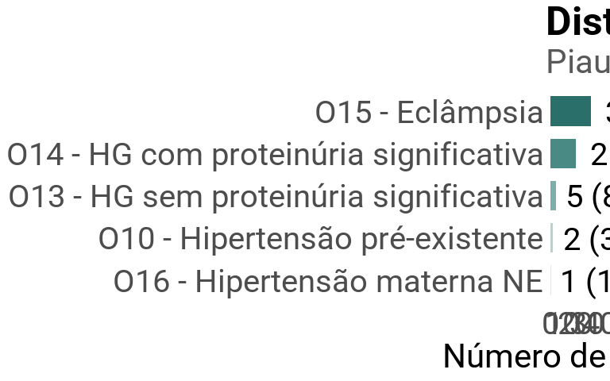
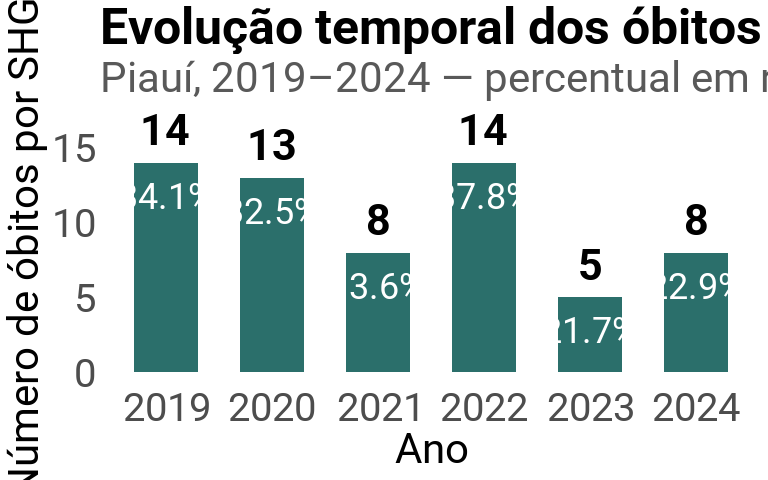
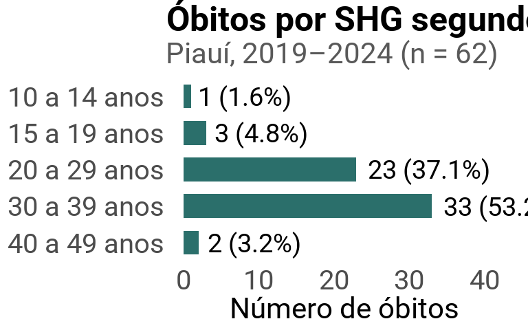
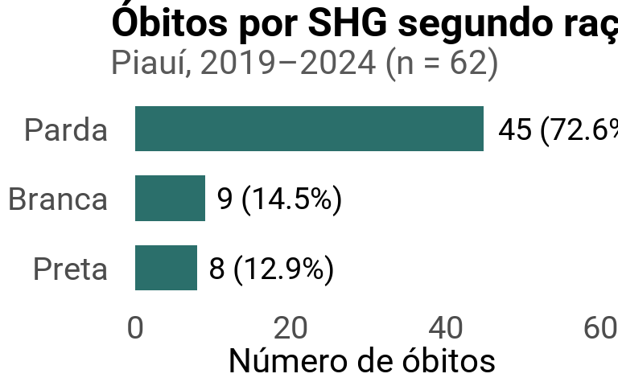
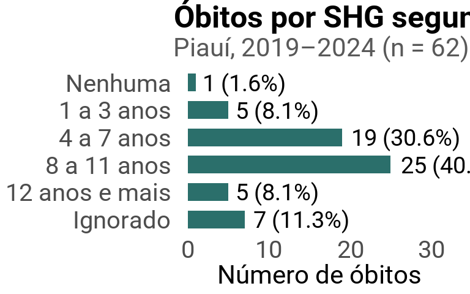
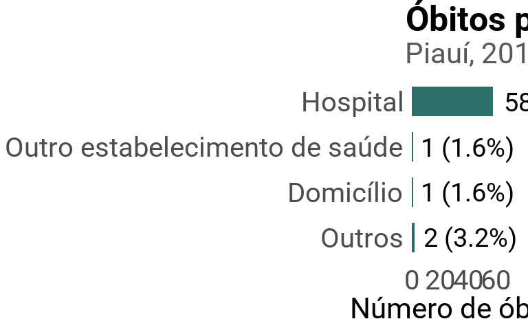
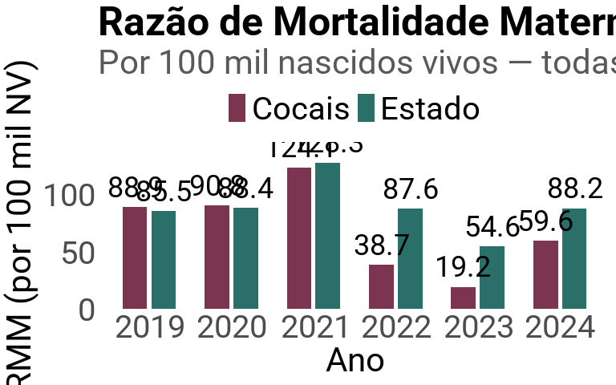
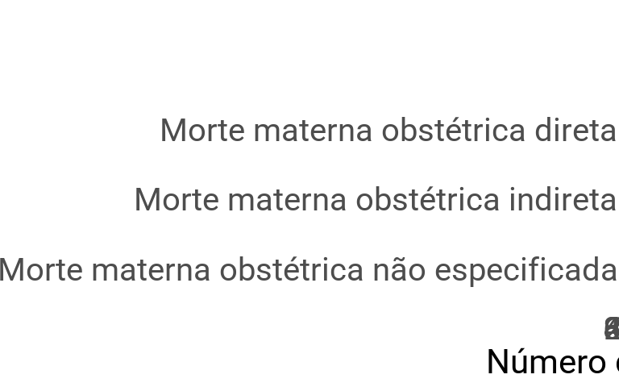
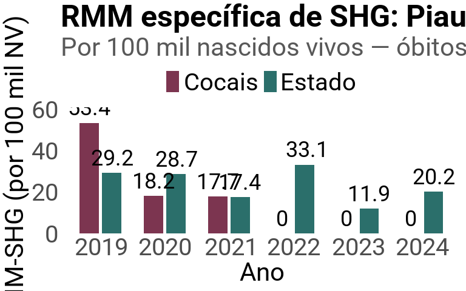

Óbitos Maternos por Síndromes Hipertensivas na Gestação (SHG)
================
Susana Silva LimaRosa Maria do Rego LimaRomério de Oliveira Lima Filho
(responsável pela análise)Mara Regina Pereira Viana Damasceno Feitosa
29/07/2026

- [Sobre esta análise](#sobre-esta-análise)
- [1. Pacotes](#1-pacotes)
- [2. Fonte tipográfica (Roboto) e tema
  visual](#2-fonte-tipográfica-roboto-e-tema-visual)
- [3. Caminhos, pastas de saída e códigos CID-10 de
  SHG](#3-caminhos-pastas-de-saída-e-códigos-cid-10-de-shg)
- [4. Funções auxiliares](#4-funções-auxiliares)
- [5. Leitura dos dados](#5-leitura-dos-dados)
- [6. Figura 1 — Distribuição por tipo de síndrome
  hipertensiva](#6-figura-1--distribuição-por-tipo-de-síndrome-hipertensiva)
- [7. Figura 2 — Evolução temporal](#7-figura-2--evolução-temporal)
- [8. Figura 3 — Perfil por faixa
  etária](#8-figura-3--perfil-por-faixa-etária)
- [9. Figura 4 — Perfil por raça/cor](#9-figura-4--perfil-por-raçacor)
- [10. Figura 5 — Perfil por
  escolaridade](#10-figura-5--perfil-por-escolaridade)
- [11. Figura 6 — Perfil por local de
  ocorrência](#11-figura-6--perfil-por-local-de-ocorrência)
- [12. Figura 7 — Comparação RMM: Piauí x Região dos
  Cocais](#12-figura-7--comparação-rmm-piauí-x-região-dos-cocais)
- [13. Figuras extras (material
  suplementar)](#13-figuras-extras-material-suplementar)
- [14. Estatística descritiva](#14-estatística-descritiva)
- [15. Testes de associação: perfil sociodemográfico SHG x demais
  causas](#15-testes-de-associação-perfil-sociodemográfico-shg-x-demais-causas)
- [16. Tendência temporal: testes formais e intervalos de
  confiança](#16-tendência-temporal-testes-formais-e-intervalos-de-confiança)
- [17. SHG na Região dos Cocais: RMM específica e comparação com o
  Estado](#17-shg-na-região-dos-cocais-rmm-específica-e-comparação-com-o-estado)

## Sobre esta análise

Análise descritiva dos óbitos maternos por Síndromes Hipertensivas na
Gestação (SHG) no Piauí entre 2019 e 2024, com comparação à Região de
Saúde dos Cocais. CID-10 considerados: **O10, O11, O13, O14, O15 e
O16**.

Fonte dos dados: MS/SVSA/CGIAE — Sistema de Informações sobre
Mortalidade (SIM) e Sistema de Informações sobre Nascidos Vivos
(SINASC), DATASUS/Tabnet.

Cada seção abaixo corresponde a uma análise/gráfico independente — rode
os chunks na ordem (ou use *Run All*) para reproduzir todas as figuras e
tabelas em `figuras/` e `tabelas/`.

## 1. Pacotes

``` r
pacotes <- c("readxl", "dplyr", "tidyr", "stringr", "forcats",
             "ggplot2", "scales", "readr", "sysfonts", "showtext", "tibble")
faltando <- pacotes[!(pacotes %in% installed.packages()[, "Package"])]
if (length(faltando) > 0) install.packages(faltando, repos = "https://cloud.r-project.org")
invisible(lapply(pacotes, library, character.only = TRUE))
```

## 2. Fonte tipográfica (Roboto) e tema visual

Todas as figuras usam a fonte **Roboto** (baixada do Google Fonts na
primeira execução) e não têm linhas de grade no fundo.

``` r
font_add_google("Roboto", "Roboto")
showtext_auto()
showtext_opts(dpi = 300)

fonte_base <- "Roboto"

tema_artigo <- theme_minimal(base_size = 12, base_family = fonte_base) +
  theme(
    plot.title = element_text(face = "bold", size = 12, hjust = 0),
    plot.subtitle = element_text(color = "grey35", size = 10),
    axis.title = element_text(size = 10),
    panel.grid = element_blank(),
    legend.position = "top",
    legend.title = element_blank()
  )
```

## 3. Caminhos, pastas de saída e códigos CID-10 de SHG

``` r
arq_obitos <- "dados/Óbitos maternos piauí 2019 a 2024 .xlsx"
arq_graf   <- "dados/Gráficos e indicadores.xlsx"

dir_figuras <- "figuras"
dir_tabelas <- "tabelas"
if (!dir.exists(dir_figuras)) dir.create(dir_figuras)
if (!dir.exists(dir_tabelas)) dir.create(dir_tabelas)

cid_shg <- c("O10", "O11", "O13", "O14", "O15", "O16")

rotulos_cid <- c(
  O10 = "O10 - Hipertensão pré-existente",
  O11 = "O11 - Hipert. pré-exist. c/ proteinúria",
  O13 = "O13 - HG sem proteinúria significativa",
  O14 = "O14 - HG com proteinúria significativa",
  O15 = "O15 - Eclâmpsia",
  O16 = "O16 - Hipertensão materna NE"
)

cor_estado <- "#2B6F6B"
cor_cocais <- "#7C3550"
paleta_shg <- c("#DCEAE8", "#B7D3D0", "#7FADA9", "#4A8A85", "#2B6F6B", "#194845")
```

## 4. Funções auxiliares

``` r
# Processa uma tabela crua "Categoria CID-10 x dimensão" (já lida, de xlsx
# ou de texto) e mantém só as linhas de SHG
processar_tabela_cid <- function(bruto) {
  names(bruto)[1] <- "categoria_cid"

  bruto %>%
    mutate(cid = str_extract(categoria_cid, "^[A-Z][0-9]{2}")) %>%
    filter(cid %in% cid_shg) %>%
    mutate(
      cid = factor(cid, levels = cid_shg),
      rotulo = unname(rotulos_cid[as.character(cid)])
    ) %>%
    select(-categoria_cid) %>%
    relocate(cid, rotulo) %>%
    mutate(across(-c(cid, rotulo),
                  ~ as.numeric(str_replace(as.character(.), "^-$", "0"))))
}

# Lê uma tabela "Categoria CID-10 x dimensão" exportada do Tabnet em xlsx
ler_tabela_cid <- function(caminho, aba, skip = 3) {
  processar_tabela_cid(read_excel(caminho, sheet = aba, skip = skip))
}

# Mesma coisa, mas para as tabelas extras copiadas manualmente do Tabnet
# em .tsv (Seção 17 — Tabnet não permite cruzar 3 dimensões de uma vez,
# então essas foram geradas filtrando "Região de Saúde" antes de exportar)
ler_tabela_cid_txt <- function(caminho, skip = 0) {
  processar_tabela_cid(read_delim(caminho, delim = "\t", skip = skip, show_col_types = FALSE))
}

# Monta SHG vs Não-SHG por categoria de uma dimensão sociodemográfica, a
# partir da MESMA planilha usada em ler_tabela_cid (que já traz todas as
# categorias de CID-10, não só SHG) — usado nos testes de associação
# da Seção 15
tabela_shg_vs_naoshg <- function(caminho, aba, skip = 3) {
  bruto <- read_excel(caminho, sheet = aba, skip = skip)
  names(bruto)[1] <- "categoria_cid"
  bruto_num <- bruto %>%
    mutate(across(-categoria_cid, ~ as.numeric(str_replace(as.character(.), "^-$", "0"))))

  total_vec <- bruto_num %>%
    filter(categoria_cid == "Total") %>%
    select(-categoria_cid, -Total) %>%
    unlist()

  shg_vec <- bruto_num %>%
    filter(str_extract(categoria_cid, "^[A-Z][0-9]{2}") %in% cid_shg) %>%
    select(-categoria_cid, -Total) %>%
    summarise(across(everything(), sum)) %>%
    unlist()

  tibble(
    categoria = names(total_vec),
    SHG       = as.integer(shg_vec),
    Não_SHG   = as.integer(total_vec - shg_vec)
  )
}

# Teste exato de Fisher (SHG x Não-SHG) para uma dimensão sociodemográfica.
# H0: a distribuição da variável é igual entre os dois grupos. Cai para
# p-valor simulado (Monte Carlo) se a tabela for grande demais para o
# cálculo exato.
teste_shg_vs_naoshg <- function(caminho, aba, skip = 3) {
  tab <- tabela_shg_vs_naoshg(caminho, aba, skip)
  mat <- as.matrix(tab[, c("SHG", "Não_SHG")])
  rownames(mat) <- tab$categoria

  teste <- tryCatch(
    fisher.test(mat),
    error = function(e) fisher.test(mat, simulate.p.value = TRUE, B = 100000)
  )

  tab %>%
    mutate(
      pct_SHG     = round(SHG / sum(SHG) * 100, 1),
      pct_Não_SHG = round(Não_SHG / sum(Não_SHG) * 100, 1),
      p_valor     = teste$p.value
    )
}

# Soma as categorias de SHG em cada dimensão sociodemográfica (perfil).
# fct_rev(fct_inorder()) mantém a ordem crescente das colunas de cima para
# baixo depois do coord_flip (ex.: "10 a 14 anos" no topo, "40 a 49" embaixo)
perfil_resumo <- function(tabela, nome_dimensao) {
  tabela %>%
    select(-cid, -rotulo, -Total) %>%
    summarise(across(everything(), sum)) %>%
    pivot_longer(everything(), names_to = nome_dimensao, values_to = "n") %>%
    mutate(
      pct = n / sum(n) * 100,
      !!nome_dimensao := fct_rev(fct_inorder(.data[[nome_dimensao]]))
    )
}

# Ordena por magnitude (maior no topo), mas força qualquer categoria
# residual "Outro/Outros..." para a última barra, mesmo que tenha valor alto
ordenar_outros_por_ultimo <- function(categoria, n) {
  eh_outro <- str_detect(as.character(categoria), regex("^outr[oa]s?$", ignore_case = TRUE))
  fct_reorder(categoria, n - ifelse(eh_outro, 1e6, 0))
}

# remover_zeros = TRUE tira do GRÁFICO as categorias com 0 óbitos (a tabela
# exportada continua com todas as categorias, zeros incluídos)
grafico_perfil <- function(dados, dimensao, titulo, cor_barra = cor_estado,
                            remover_zeros = TRUE) {
  dados_grafico <- if (remover_zeros) filter(dados, n > 0) else dados

  ggplot(dados_grafico, aes(x = .data[[dimensao]], y = n)) +
    geom_col(fill = cor_barra, width = 0.65) +
    geom_text(aes(label = paste0(n, " (", round(pct, 1), "%)")),
              hjust = -0.1, size = 3.2, family = fonte_base) +
    coord_flip(clip = "off") +
    scale_y_continuous(limits = c(0, max(dados_grafico$n) * 1.3)) +
    labs(title = titulo, subtitle = "Piauí, 2019–2024 (n = 62)",
         x = NULL, y = "Número de óbitos") +
    tema_artigo
}

# Salva cada figura em PNG (300dpi) e PDF vetorial (fonte Roboto embutida
# via cairo_pdf) dentro de figuras/ — sem legenda de fonte embutida na
# imagem (a citação da fonte fica como texto no corpo deste documento)
salvar_figura <- function(grafico, nome, largura = 18, altura = 10) {
  ggsave(file.path(dir_figuras, paste0(nome, ".png")), grafico,
         width = largura, height = altura, units = "cm", dpi = 300)
  ggsave(file.path(dir_figuras, paste0(nome, ".pdf")), grafico,
         width = largura, height = altura, units = "cm",
         device = grDevices::cairo_pdf)
}

# Exporta tabela em .csv (';' + UTF-8 com BOM) para abrir certo no Excel,
# sem "Domicílio" / "Via pública" etc.
salvar_tabela <- function(tabela, nome) {
  write_excel_csv2(tabela, file.path(dir_tabelas, paste0(nome, ".csv")))
}
```

## 5. Leitura dos dados

``` r
shg_ano          <- ler_tabela_cid(arq_obitos, "sim_cnv_mat10pi091246191_36_186")
shg_faixa_etaria <- ler_tabela_cid(arq_obitos, "fx etaria")
shg_escolaridade <- ler_tabela_cid(arq_obitos, "escolaridade")
shg_raca_cor     <- ler_tabela_cid(arq_obitos, "raça cor")
shg_local        <- ler_tabela_cid(arq_obitos, "local ocorrencia")
shg_causa_obst   <- ler_tabela_cid(arq_obitos, "causa obstetrica")
shg_investigado  <- ler_tabela_cid(arq_obitos, "ob materno investigado")

# Total de óbitos maternos (TODAS as causas) por ano, para a % da SHG no ano
obitos_totais_ano <- read_excel(arq_obitos, sheet = "sim_cnv_mat10pi091246191_36_186", skip = 3) %>%
  filter(`Categoria CID-10` == "Total") %>%
  select(-`Categoria CID-10`, -Total) %>%
  pivot_longer(everything(), names_to = "ano", values_to = "obitos_totais") %>%
  mutate(ano = as.integer(ano), obitos_totais = as.numeric(obitos_totais))

# RMM (Razão de Mortalidade Materna) Piauí x Região dos Cocais - todas as
# causas de óbito materno
rmm_valor <- read_excel(arq_graf, sheet = "Comparação RMM Estado x Região", range = "A11:G13") %>%
  rename(area = 1) %>%
  pivot_longer(-area, names_to = "ano", values_to = "rmm") %>%
  mutate(ano = as.integer(ano), area = str_trim(area))

# Nascidos vivos por ano (Piauí e Região dos Cocais) — denominador usado
# nas RMM gerais e na RMM específica de SHG (Seção 17)
nascidos_vivos <- read_excel(arq_graf, sheet = "Comparação RMM Estado x Região", range = "A7:G9") %>%
  rename(area = 1) %>%
  pivot_longer(-area, names_to = "ano", values_to = "nascidos_vivos") %>%
  mutate(ano = as.integer(ano), area = str_trim(area))
```

## 6. Figura 1 — Distribuição por tipo de síndrome hipertensiva

*Objetivo específico: identificar a distribuição dos casos por tipo de
síndrome hipertensiva gestacional. O11 não teve registros no período.*

``` r
dist_tipo <- shg_ano %>%
  select(cid, rotulo, Total) %>%
  arrange(desc(Total)) %>%
  mutate(
    pct = Total / sum(Total) * 100,
    rotulo = ordenar_outros_por_ultimo(rotulo, Total)
  )

fig1 <- ggplot(dist_tipo, aes(x = rotulo, y = Total, fill = rotulo)) +
  geom_col(width = 0.7, show.legend = FALSE) +
  geom_text(aes(label = paste0(Total, " (", round(pct, 1), "%)")),
            hjust = -0.1, size = 3.4, family = fonte_base) +
  coord_flip(clip = "off") +
  scale_y_continuous(limits = c(0, max(dist_tipo$Total) * 1.25)) +
  scale_fill_manual(values = paleta_shg) +
  labs(
    title = "Distribuição dos óbitos por tipo de síndrome hipertensiva",
    subtitle = "Piauí, 2019–2024 (n = 62)",
    x = NULL, y = "Número de óbitos"
  ) +
  tema_artigo

fig1
```

<!-- -->

``` r
salvar_figura(fig1, "fig1_distribuicao_tipo_shg")

# IC 95% (exato, binomial) do percentual de cada tipo dentro do total de
# SHG — útil para o texto do artigo, não aparece na figura
ic_tipo <- mapply(function(x, n) binom.test(x, n)$conf.int * 100,
                   dist_tipo$Total, sum(dist_tipo$Total))
dist_tipo <- dist_tipo %>%
  mutate(ic95_inf = round(ic_tipo[1, ], 1), ic95_sup = round(ic_tipo[2, ], 1))

dist_tipo
```

<div class="kable-table">

| cid | rotulo                                 | Total |       pct | ic95_inf | ic95_sup |
|:----|:---------------------------------------|------:|----------:|---------:|---------:|
| O15 | O15 - Eclâmpsia                        |    33 | 53.225806 |     40.1 |     66.0 |
| O14 | O14 - HG com proteinúria significativa |    21 | 33.870968 |     22.3 |     47.0 |
| O13 | O13 - HG sem proteinúria significativa |     5 |  8.064516 |      2.7 |     17.8 |
| O10 | O10 - Hipertensão pré-existente        |     2 |  3.225807 |      0.4 |     11.2 |
| O16 | O16 - Hipertensão materna NE           |     1 |  1.612903 |      0.0 |      8.7 |

</div>

``` r
salvar_tabela(dist_tipo, "distribuicao_tipo")
```

*Fonte: MS/SVSA/CGIAE — SIM/DATASUS. O11 não teve registros no período.*

## 7. Figura 2 — Evolução temporal

*Objetivo específico: analisar a evolução temporal dos óbitos por SHG.*

``` r
evolucao <- shg_ano %>%
  select(-cid, -rotulo, -Total) %>%
  summarise(across(everything(), sum)) %>%
  pivot_longer(everything(), names_to = "ano", values_to = "obitos_shg") %>%
  mutate(ano = as.integer(ano)) %>%
  left_join(obitos_totais_ano, by = "ano") %>%
  mutate(pct_shg = obitos_shg / obitos_totais * 100)

fig2 <- ggplot(evolucao, aes(x = factor(ano), y = obitos_shg)) +
  geom_col(fill = cor_estado, width = 0.6) +
  geom_text(aes(label = obitos_shg), vjust = -0.6, size = 3.6,
            fontface = "bold", family = fonte_base) +
  geom_text(aes(label = paste0(round(pct_shg, 1), "%")),
            vjust = 1.8, size = 3, color = "white", family = fonte_base) +
  scale_y_continuous(limits = c(0, max(evolucao$obitos_shg) * 1.2)) +
  labs(
    title = "Evolução temporal dos óbitos por SHG",
    subtitle = "Piauí, 2019–2024 — percentual em relação ao total de óbitos maternos do ano",
    x = "Ano", y = "Número de óbitos por SHG"
  ) +
  tema_artigo

fig2
```

<!-- -->

``` r
salvar_figura(fig2, "fig2_evolucao_temporal")
salvar_tabela(evolucao, "evolucao_temporal")
```

*Fonte: MS/SVSA/CGIAE — SIM/DATASUS.*

## 8. Figura 3 — Perfil por faixa etária

*Objetivo específico: perfil epidemiológico (faixa etária).*

``` r
perfil_faixa <- perfil_resumo(shg_faixa_etaria, "faixa_etaria")
fig3 <- grafico_perfil(perfil_faixa, "faixa_etaria",
                        "Óbitos por SHG segundo faixa etária")
fig3
```

<!-- -->

``` r
salvar_figura(fig3, "fig3_faixa_etaria")
salvar_tabela(perfil_faixa, "perfil_faixa_etaria")
```

*Fonte: MS/SVSA/CGIAE — SIM/DATASUS.*

## 9. Figura 4 — Perfil por raça/cor

*Objetivo específico: perfil epidemiológico (etnia/cor).*

``` r
perfil_raca <- perfil_resumo(shg_raca_cor, "raca_cor") %>%
  mutate(raca_cor = ordenar_outros_por_ultimo(raca_cor, n))
fig4 <- grafico_perfil(perfil_raca, "raca_cor",
                        "Óbitos por SHG segundo raça/cor")
fig4
```

<!-- -->

``` r
salvar_figura(fig4, "fig4_raca_cor")
salvar_tabela(perfil_raca, "perfil_raca_cor")
```

*Fonte: MS/SVSA/CGIAE — SIM/DATASUS.*

## 10. Figura 5 — Perfil por escolaridade

*Objetivo específico: perfil epidemiológico (escolaridade).*

``` r
perfil_escolaridade <- perfil_resumo(shg_escolaridade, "escolaridade")
fig5 <- grafico_perfil(perfil_escolaridade, "escolaridade",
                        "Óbitos por SHG segundo escolaridade")
fig5
```

<!-- -->

``` r
salvar_figura(fig5, "fig5_escolaridade")
salvar_tabela(perfil_escolaridade, "perfil_escolaridade")
```

*Fonte: MS/SVSA/CGIAE — SIM/DATASUS.*

## 11. Figura 6 — Perfil por local de ocorrência

*Objetivo específico: perfil epidemiológico (local de ocorrência).*

``` r
perfil_local <- perfil_resumo(shg_local, "local") %>%
  mutate(local = ordenar_outros_por_ultimo(local, n))
fig6 <- grafico_perfil(perfil_local, "local",
                        "Óbitos por SHG segundo local de ocorrência")
fig6
```

<!-- -->

``` r
salvar_figura(fig6, "fig6_local_ocorrencia")
salvar_tabela(perfil_local, "perfil_local_ocorrencia")
```

*Fonte: MS/SVSA/CGIAE — SIM/DATASUS. Categorias sem nenhum registro
(Ignorado, Via pública) ficam de fora do gráfico, mas continuam na
tabela exportada.*

## 12. Figura 7 — Comparação RMM: Piauí x Região dos Cocais

*Objetivo geral: comparação da mortalidade materna entre a Região dos
Cocais e o Estado. Esta primeira figura usa óbitos maternos de TODAS as
causas, como panorama geral — a RMM específica de SHG por região, obtida
com uma consulta adicional no Tabnet, está na Seção 17.*

``` r
fig7 <- ggplot(rmm_valor, aes(x = factor(ano), y = rmm, fill = area, group = area)) +
  geom_col(position = position_dodge(width = 0.7), width = 0.6) +
  geom_text(aes(label = round(rmm, 1)),
            position = position_dodge(width = 0.7), vjust = -0.5, size = 3,
            family = fonte_base) +
  scale_fill_manual(values = c("Cocais" = cor_cocais, "Estado" = cor_estado)) +
  scale_y_continuous(expand = expansion(mult = c(0, 0.14))) +
  labs(
    title = "Razão de Mortalidade Materna: Piauí x Região dos Cocais",
    subtitle = "Por 100 mil nascidos vivos — todas as causas de óbito materno",
    x = "Ano", y = "RMM (por 100 mil NV)"
  ) +
  tema_artigo

fig7
```

<!-- -->

``` r
salvar_figura(fig7, "fig7_rmm_piaui_cocais")
salvar_tabela(rmm_valor, "rmm_piaui_cocais")
```

*Fonte: SIM e SINASC/DATASUS. RMM de todas as causas — a versão
específica de SHG está na Seção 17.*

## 13. Figuras extras (material suplementar)

Tipo de causa obstétrica e situação de investigação do óbito.

``` r
perfil_causa <- perfil_resumo(shg_causa_obst, "tipo_causa") %>%
  mutate(tipo_causa = ordenar_outros_por_ultimo(tipo_causa, n))
# remover_zeros = FALSE: mantém a barra de "não especificada" mesmo em 0%
fig8 <- grafico_perfil(perfil_causa, "tipo_causa",
                        "Óbitos por SHG segundo tipo de causa obstétrica",
                        remover_zeros = FALSE)
fig8
```

<!-- -->

``` r
salvar_figura(fig8, "fig8_tipo_causa_obstetrica", altura = 6)

perfil_investigado <- perfil_resumo(shg_investigado, "situacao") %>%
  mutate(situacao = ordenar_outros_por_ultimo(situacao, n))
fig9 <- grafico_perfil(perfil_investigado, "situacao",
                        "Óbitos por SHG segundo situação de investigação")
fig9
```

<!-- -->

``` r
salvar_figura(fig9, "fig9_situacao_investigacao", altura = 6)

salvar_tabela(perfil_causa, "perfil_tipo_causa_obstetrica")
salvar_tabela(perfil_investigado, "perfil_situacao_investigacao")
```

*Fonte: MS/SVSA/CGIAE — SIM/DATASUS.*

## 14. Estatística descritiva

*Média, mediana, desvio padrão dos óbitos por SHG por ano, conforme
previsto nos Métodos do projeto.*

``` r
estat_desc_ano <- evolucao %>%
  summarise(
    total   = sum(obitos_shg),
    media   = mean(obitos_shg),
    mediana = median(obitos_shg),
    dp      = sd(obitos_shg),
    minimo  = min(obitos_shg),
    maximo  = max(obitos_shg)
  )

estat_desc_ano
```

<div class="kable-table">

| total |    media | mediana |       dp | minimo | maximo |
|------:|---------:|--------:|---------:|-------:|-------:|
|    62 | 10.33333 |    10.5 | 3.829708 |      5 |     14 |

</div>

``` r
salvar_tabela(estat_desc_ano, "estatistica_descritiva_ano")
```

## 15. Testes de associação: perfil sociodemográfico SHG x demais causas

*Enriquecimento estatístico: em vez de só descrever o perfil de quem
morreu por SHG, compara esse perfil com o de quem morreu por outras
causas maternas no mesmo período — teste exato de Fisher em tabela de
contingência (H0: a distribuição da variável não difere entre os dois
grupos; p \< 0,05 rejeita H0).*

``` r
resultados_associacao <- list(
  "Faixa etária"        = teste_shg_vs_naoshg(arq_obitos, "fx etaria"),
  "Raça/cor"             = teste_shg_vs_naoshg(arq_obitos, "raça cor"),
  "Escolaridade"          = teste_shg_vs_naoshg(arq_obitos, "escolaridade"),
  "Local de ocorrência"   = teste_shg_vs_naoshg(arq_obitos, "local ocorrencia")
)

resumo_p_associacao <- tibble(
  dimensao = names(resultados_associacao),
  p_valor  = vapply(resultados_associacao, function(x) unique(x$p_valor), numeric(1))
) %>%
  mutate(significativo_5pct = ifelse(p_valor < 0.05, "Sim", "Não"))

resumo_p_associacao
```

<div class="kable-table">

| dimensao            |   p_valor | significativo_5pct |
|:--------------------|----------:|:-------------------|
| Faixa etária        | 0.3037325 | Não                |
| Raça/cor            | 0.4972265 | Não                |
| Escolaridade        | 0.0986907 | Não                |
| Local de ocorrência | 0.5522493 | Não                |

</div>

``` r
resultados_associacao[["Faixa etária"]]
```

<div class="kable-table">

| categoria    | SHG | Não_SHG | pct_SHG | pct_Não_SHG |   p_valor |
|:-------------|----:|--------:|--------:|------------:|----------:|
| 10 a 14 anos |   1 |       1 |     1.6 |         0.6 | 0.3037325 |
| 15 a 19 anos |   3 |      17 |     4.8 |         9.8 | 0.3037325 |
| 20 a 29 anos |  23 |      75 |    37.1 |        43.4 | 0.3037325 |
| 30 a 39 anos |  33 |      70 |    53.2 |        40.5 | 0.3037325 |
| 40 a 49 anos |   2 |      10 |     3.2 |         5.8 | 0.3037325 |

</div>

``` r
resultados_associacao[["Raça/cor"]]
```

<div class="kable-table">

| categoria | SHG | Não_SHG | pct_SHG | pct_Não_SHG |   p_valor |
|:----------|----:|--------:|--------:|------------:|----------:|
| Branca    |   9 |      23 |    14.5 |        13.3 | 0.4972265 |
| Preta     |   8 |      14 |    12.9 |         8.1 | 0.4972265 |
| Parda     |  45 |     132 |    72.6 |        76.3 | 0.4972265 |
| Ignorado  |   0 |       4 |     0.0 |         2.3 | 0.4972265 |

</div>

``` r
resultados_associacao[["Escolaridade"]]
```

<div class="kable-table">

| categoria      | SHG | Não_SHG | pct_SHG | pct_Não_SHG |   p_valor |
|:---------------|----:|--------:|--------:|------------:|----------:|
| Nenhuma        |   1 |       4 |     1.6 |         2.3 | 0.0986907 |
| 1 a 3 anos     |   5 |      10 |     8.1 |         5.8 | 0.0986907 |
| 4 a 7 anos     |  19 |      30 |    30.6 |        17.3 | 0.0986907 |
| 8 a 11 anos    |  25 |      66 |    40.3 |        38.2 | 0.0986907 |
| 12 anos e mais |   5 |      20 |     8.1 |        11.6 | 0.0986907 |
| Ignorado       |   7 |      43 |    11.3 |        24.9 | 0.0986907 |

</div>

``` r
resultados_associacao[["Local de ocorrência"]]
```

<div class="kable-table">

| categoria                      | SHG | Não_SHG | pct_SHG | pct_Não_SHG |   p_valor |
|:-------------------------------|----:|--------:|--------:|------------:|----------:|
| Hospital                       |  58 |     161 |    93.5 |        93.1 | 0.5522493 |
| Outro estabelecimento de saúde |   1 |       2 |     1.6 |         1.2 | 0.5522493 |
| Domicílio                      |   1 |       7 |     1.6 |         4.0 | 0.5522493 |
| Via pública                    |   0 |       1 |     0.0 |         0.6 | 0.5522493 |
| Outros                         |   2 |       1 |     3.2 |         0.6 | 0.5522493 |
| Ignorado                       |   0 |       1 |     0.0 |         0.6 | 0.5522493 |

</div>

``` r
salvar_tabela(resumo_p_associacao, "associacao_resumo_pvalores")
salvar_tabela(resultados_associacao[["Faixa etária"]], "associacao_faixa_etaria")
salvar_tabela(resultados_associacao[["Raça/cor"]], "associacao_raca_cor")
salvar_tabela(resultados_associacao[["Escolaridade"]], "associacao_escolaridade")
salvar_tabela(resultados_associacao[["Local de ocorrência"]], "associacao_local_ocorrencia")
```

*Fonte: MS/SVSA/CGIAE — SIM/DATASUS. “Não-SHG” = todos os demais óbitos
maternos do período (todas as causas exceto O10, O11, O13-O16).*

## 16. Tendência temporal: testes formais e intervalos de confiança

*Enriquecimento estatístico: formaliza a leitura da Seção 7 com um
intervalo de confiança em cada ano, um teste de tendência na proporção
(Cochran-Armitage) e uma regressão de Poisson na razão de mortalidade
específica de SHG (óbitos SHG / nascidos vivos), que ajusta pela
variação do denominador populacional ano a ano.*

``` r
# IC 95% exato (binomial) da % de SHG no total de óbitos maternos, por ano
ic_evolucao <- mapply(function(x, n) binom.test(x, n)$conf.int * 100,
                       evolucao$obitos_shg, evolucao$obitos_totais)
evolucao <- evolucao %>%
  mutate(ic95_inf = round(ic_evolucao[1, ], 1), ic95_sup = round(ic_evolucao[2, ], 1))

evolucao
```

<div class="kable-table">

|  ano | obitos_shg | obitos_totais |  pct_shg | ic95_inf | ic95_sup |
|-----:|-----------:|--------------:|---------:|---------:|---------:|
| 2019 |         14 |            41 | 34.14634 |     20.1 |     50.6 |
| 2020 |         13 |            40 | 32.50000 |     18.6 |     49.1 |
| 2021 |          8 |            59 | 13.55932 |      6.0 |     25.0 |
| 2022 |         14 |            37 | 37.83784 |     22.5 |     55.2 |
| 2023 |          5 |            23 | 21.73913 |      7.5 |     43.7 |
| 2024 |          8 |            35 | 22.85714 |     10.4 |     40.1 |

</div>

``` r
salvar_tabela(evolucao, "evolucao_temporal")

# Teste de tendência (Cochran-Armitage) — a proporção de SHG entre os
# óbitos maternos muda de forma monotônica ao longo dos anos?
teste_tendencia_prop <- prop.trend.test(x = evolucao$obitos_shg,
                                          n = evolucao$obitos_totais,
                                          score = evolucao$ano)
teste_tendencia_prop
```

    ## 
    ##  Chi-squared Test for Trend in Proportions
    ## 
    ## data:  evolucao$obitos_shg out of evolucao$obitos_totais ,
    ##  using scores: 2019 2020 2021 2022 2023 2024
    ## X-squared = 0.88687, df = 1, p-value = 0.3463

``` r
# Regressão de Poisson: tendência na RMM específica de SHG (óbitos SHG
# por 100 mil nascidos vivos), Piauí, 2019-2024
nascidos_vivos_estado <- nascidos_vivos %>% filter(area == "Estado")

evolucao_rmm <- evolucao %>%
  left_join(select(nascidos_vivos_estado, ano, nascidos_vivos), by = "ano") %>%
  mutate(rmm_shg = obitos_shg / nascidos_vivos * 100000)

evolucao_rmm
```

<div class="kable-table">

| ano | obitos_shg | obitos_totais | pct_shg | ic95_inf | ic95_sup | nascidos_vivos | rmm_shg |
|---:|---:|---:|---:|---:|---:|---:|---:|
| 2019 | 14 | 41 | 34.14634 | 20.1 | 50.6 | 47933 | 29.20744 |
| 2020 | 13 | 40 | 32.50000 | 18.6 | 49.1 | 45229 | 28.74262 |
| 2021 | 8 | 59 | 13.55932 | 6.0 | 25.0 | 45978 | 17.39963 |
| 2022 | 14 | 37 | 37.83784 | 22.5 | 55.2 | 42247 | 33.13845 |
| 2023 | 5 | 23 | 21.73913 | 7.5 | 43.7 | 42144 | 11.86408 |
| 2024 | 8 | 35 | 22.85714 | 10.4 | 40.1 | 39697 | 20.15266 |

</div>

``` r
modelo_tendencia_rmm <- glm(obitos_shg ~ ano, offset = log(nascidos_vivos),
                             family = poisson, data = evolucao_rmm)
summary(modelo_tendencia_rmm)
```

    ## 
    ## Call:
    ## glm(formula = obitos_shg ~ ano, family = poisson, data = evolucao_rmm, 
    ##     offset = log(nascidos_vivos))
    ## 
    ## Coefficients:
    ##              Estimate Std. Error z value Pr(>|z|)
    ## (Intercept) 192.11294  153.01186   1.256    0.209
    ## ano          -0.09918    0.07571  -1.310    0.190
    ## 
    ## (Dispersion parameter for poisson family taken to be 1)
    ## 
    ##     Null deviance: 6.5617  on 5  degrees of freedom
    ## Residual deviance: 4.8229  on 4  degrees of freedom
    ## AIC: 33.573
    ## 
    ## Number of Fisher Scoring iterations: 4

``` r
# Razão de taxas por ano adicional (ex.: 0,95 = queda de ~5% ao ano na RMM-SHG)
razao_taxa_anual <- exp(coef(modelo_tendencia_rmm)["ano"])
ic_razao_taxa_anual <- exp(confint(modelo_tendencia_rmm)["ano", ])
c(razao_taxa_anual = razao_taxa_anual, ic_razao_taxa_anual)
```

    ## razao_taxa_anual.ano                2.5 %               97.5 % 
    ##            0.9055803            0.7789315            1.0490930

``` r
salvar_tabela(evolucao_rmm, "evolucao_rmm_shg_piaui")
```

*Fonte: MS/SVSA/CGIAE — SIM/DATASUS e SINASC/DATASUS.*

## 17. SHG na Região dos Cocais: RMM específica e comparação com o Estado

*Fecha a lacuna da Seção 12: o Tabnet não gera uma tabela pronta
cruzando CID-10 × Região de Saúde × Ano, então essas duas tabelas foram
obtidas com uma consulta adicional no Tabnet (SIM/PI), filtrando “Região
de Saúde = Cocais” antes de exportar — arquivos em
`dados/shg_regiao_saude_2019_2024.tsv` e
`dados/shg_cocais_ano_2019_2024.tsv`. Com poucos eventos por ano na
Região dos Cocais (0 a 3), os intervalos de confiança são largos —
interpretar com cautela.*

``` r
shg_regiao     <- ler_tabela_cid_txt("dados/shg_regiao_saude_2019_2024.tsv")
shg_cocais_ano <- ler_tabela_cid_txt("dados/shg_cocais_ano_2019_2024.tsv")

# Óbitos por SHG na Região dos Cocais, por ano
cocais_ano <- shg_cocais_ano %>%
  select(-cid, -rotulo, -Total) %>%
  summarise(across(everything(), sum)) %>%
  pivot_longer(everything(), names_to = "ano", values_to = "obitos_shg") %>%
  mutate(ano = as.integer(ano), area = "Cocais")

estado_ano <- evolucao %>% transmute(ano, obitos_shg, area = "Estado")

shg_ano_area <- bind_rows(estado_ano, cocais_ano) %>%
  left_join(nascidos_vivos, by = c("area", "ano")) %>%
  mutate(rmm_shg = obitos_shg / nascidos_vivos * 100000)

shg_ano_area
```

<div class="kable-table">

|  ano | obitos_shg | area   | nascidos_vivos |  rmm_shg |
|-----:|-----------:|:-------|---------------:|---------:|
| 2019 |         14 | Estado |          47933 | 29.20744 |
| 2020 |         13 | Estado |          45229 | 28.74262 |
| 2021 |          8 | Estado |          45978 | 17.39963 |
| 2022 |         14 | Estado |          42247 | 33.13845 |
| 2023 |          5 | Estado |          42144 | 11.86408 |
| 2024 |          8 | Estado |          39697 | 20.15266 |
| 2019 |          3 | Cocais |           5622 | 53.36179 |
| 2020 |          1 | Cocais |           5504 | 18.16860 |
| 2021 |          1 | Cocais |           5642 | 17.72421 |
| 2022 |          0 | Cocais |           5172 |  0.00000 |
| 2023 |          0 | Cocais |           5204 |  0.00000 |
| 2024 |          0 | Cocais |           5037 |  0.00000 |

</div>

``` r
fig10 <- ggplot(shg_ano_area, aes(x = factor(ano), y = rmm_shg, fill = area, group = area)) +
  geom_col(position = position_dodge(width = 0.7), width = 0.6) +
  geom_text(aes(label = ifelse(obitos_shg == 0, "0", round(rmm_shg, 1))),
            position = position_dodge(width = 0.7), vjust = -0.5, size = 3,
            family = fonte_base) +
  scale_fill_manual(values = c("Cocais" = cor_cocais, "Estado" = cor_estado)) +
  scale_y_continuous(expand = expansion(mult = c(0, 0.14))) +
  labs(
    title = "RMM específica de SHG: Piauí x Região dos Cocais",
    subtitle = "Por 100 mil nascidos vivos — óbitos maternos por SHG (O10-O16)",
    x = "Ano", y = "RMM-SHG (por 100 mil NV)"
  ) +
  tema_artigo

fig10
```

<!-- -->

``` r
salvar_figura(fig10, "fig10_rmm_shg_piaui_cocais")
salvar_tabela(shg_ano_area, "rmm_shg_piaui_cocais_ano")
```

*Fonte: MS/SVSA/CGIAE — SIM/DATASUS (consulta adicional, ver nota acima)
e SINASC/DATASUS.*

``` r
# Comparação agregada 2019-2024: Cocais x Resto do Estado (grupos
# independentes — evita comparar Cocais contra um total que já o inclui)
agregado <- shg_ano_area %>%
  group_by(area) %>%
  summarise(obitos_shg = sum(obitos_shg), nascidos_vivos = sum(nascidos_vivos)) %>%
  pivot_wider(names_from = area, values_from = c(obitos_shg, nascidos_vivos)) %>%
  mutate(
    obitos_shg_Resto     = obitos_shg_Estado - obitos_shg_Cocais,
    nascidos_vivos_Resto = nascidos_vivos_Estado - nascidos_vivos_Cocais
  )

agregado
```

<div class="kable-table">

| obitos_shg_Cocais | obitos_shg_Estado | nascidos_vivos_Cocais | nascidos_vivos_Estado | obitos_shg_Resto | nascidos_vivos_Resto |
|---:|---:|---:|---:|---:|---:|
| 5 | 62 | 32181 | 263228 | 57 | 231047 |

</div>

``` r
# Teste de razão de taxas (Poisson exato) — Cocais x Resto do Estado
teste_razao_taxas <- poisson.test(
  x = c(agregado$obitos_shg_Cocais, agregado$obitos_shg_Resto),
  T = c(agregado$nascidos_vivos_Cocais, agregado$nascidos_vivos_Resto)
)
teste_razao_taxas
```

    ## 
    ##  Comparison of Poisson rates
    ## 
    ## data:  c(agregado$obitos_shg_Cocais, agregado$obitos_shg_Resto) time base: c(agregado$nascidos_vivos_Cocais, agregado$nascidos_vivos_Resto)
    ## count1 = 5, expected count1 = 7.5798, p-value = 0.4366
    ## alternative hypothesis: true rate ratio is not equal to 1
    ## 95 percent confidence interval:
    ##  0.1969892 1.5573933
    ## sample estimates:
    ## rate ratio 
    ##  0.6297903

``` r
salvar_tabela(agregado, "rmm_shg_cocais_vs_resto_agregado")
```

*Fonte: MS/SVSA/CGIAE — SIM/DATASUS e SINASC/DATASUS. `estimate` do
teste é a razão de taxas Cocais ÷ Resto do Estado (\< 1 = Cocais com
RMM-SHG menor; intervalo cruzando 1 = diferença não significativa a
5%).*
